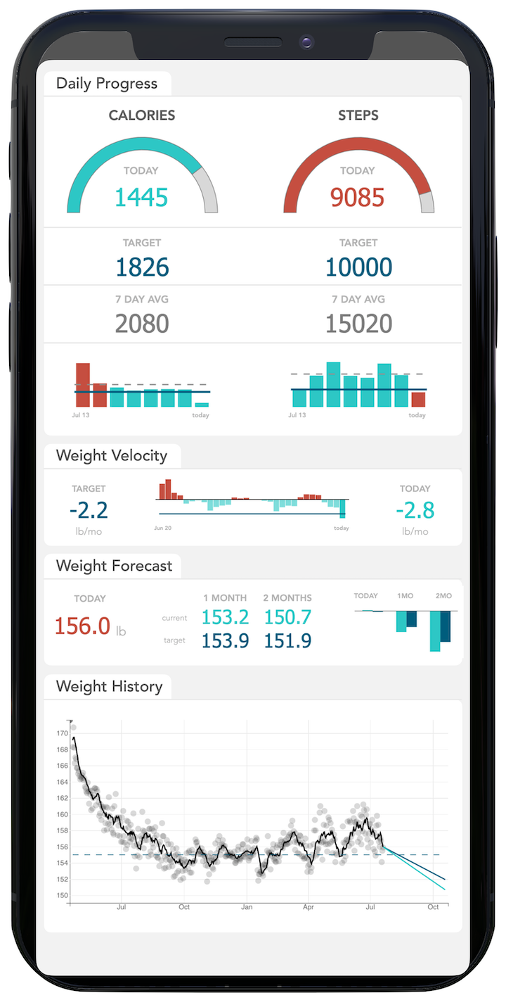

# Weight Forecaster
A personalized weight management app that uses a forecasting model to show how current behavior will impact future weight change, as well as counterfactually show what might have happened to your weight had you changed your behavior earlier. This project is an evolution of my earlier [Worldline-Weight Project](https://github.com/jamieinfinity/worldline-wgt).

## Mobile app design
This is a mockup of the mobile app. So far, I have implemented a Jupyter notebook-based version running locally. Eventually I will build a mobile and web version using Flutter.

